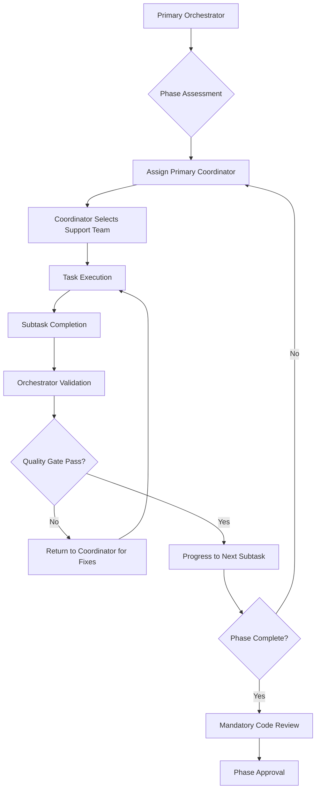

# Specialized Agent Coordination Strategy

**Author**: Gil Klainert
**Date**: 2025-09-17
**Project**: CVPlus Analytics Package - Agent Coordination
**Priority**: CRITICAL
**Status**: 🔄 READY FOR DEPLOYMENT

## Executive Summary

This document outlines the comprehensive specialized agent coordination strategy for the CVPlus Analytics package critical remediation project. The strategy defines agent assignments, task dependencies, communication protocols, and quality gate procedures to ensure successful implementation of all four major implementation plans.

## Agent Coordination Architecture

### Primary Orchestrator Role
**Primary Orchestrator**: Senior Software Architect (Current Agent)
**Responsibilities**:
- Overall project coordination and oversight
- Quality gate validation and progression control
- Inter-agent communication and dependency management
- Risk monitoring and mitigation coordination
- Final deliverable validation and approval

### Specialized Agent Deployment Matrix

#### Phase 1: Critical Stabilization (Week 1-2)

##### Primary Coordinators
1. **refactoring-architect**
   - **Domain**: File size compliance and modular design
   - **Location**: `~/.local/share/claude-007-agents/.claude/agents/engineering/refactoring-architect.md`
   - **Primary Tasks**:
     - Business Intelligence Service refactoring (737 → <200 lines)
     - Index file modularization (348 → <200 lines)
     - ML Prediction service optimization (352 → <200 lines)
   - **Dependencies**: typescript-pro, module-architect
   - **Success Criteria**: 100% file size compliance achieved

2. **backend-architect**
   - **Domain**: Production safety and system stability
   - **Location**: `~/.local/share/claude-007-agents/.claude/agents/engineering/backend-architect.md`
   - **Primary Tasks**:
     - Mock service replacement
     - Stub implementation completion
     - Error handling enhancement
   - **Dependencies**: cache-specialist, performance-engineer
   - **Success Criteria**: Zero mock services, production-ready implementations

##### Supporting Specialists

3. **typescript-pro**
   - **Domain**: TypeScript compliance and type safety
   - **Location**: `~/.local/share/claude-007-agents/.claude/agents/engineering/typescript-pro.md`
   - **Support Role**: Refactoring validation, type safety assurance
   - **Tasks**: TypeScript compilation validation, type definition enhancement

4. **ai-ml-specialist**
   - **Domain**: Machine learning pipeline implementation
   - **Location**: `~/.local/share/claude-007-agents/.claude/agents/engineering/ai-ml-specialist.md`
   - **Support Role**: ML algorithm implementation, prediction accuracy
   - **Tasks**: ML pipeline completion, algorithm optimization

5. **cache-specialist**
   - **Domain**: High-performance caching implementation
   - **Location**: `~/.local/share/claude-007-agents/.claude/agents/engineering/cache-specialist.md`
   - **Support Role**: Cache service implementation, performance optimization
   - **Tasks**: Redis integration, cache strategy optimization

6. **performance-engineer**
   - **Domain**: System performance optimization
   - **Location**: `~/.local/share/claude-007-agents/.claude/agents/engineering/performance-engineer.md`
   - **Support Role**: Performance monitoring, optimization
   - **Tasks**: Performance benchmarking, optimization implementation

#### Phase 2: Quality Assurance (Week 3-4)

##### Primary Coordinators

7. **test-writer-fixer**
   - **Domain**: Comprehensive testing implementation
   - **Location**: `~/.local/share/claude-007-agents/.claude/agents/engineering/test-writer-fixer.md`
   - **Primary Tasks**:
     - Unit testing suite implementation (90% coverage)
     - Integration testing development
     - Test framework optimization
   - **Dependencies**: backend-test-engineer, integration-tester
   - **Success Criteria**: 90% minimum test coverage achieved

8. **backend-test-engineer**
   - **Domain**: Backend testing specialization
   - **Location**: `~/.local/share/claude-007-agents/.claude/agents/engineering/backend-test-engineer.md`
   - **Primary Tasks**:
     - Analytics service unit testing
     - Firebase Functions testing
     - Service integration validation
   - **Dependencies**: test-writer-fixer
   - **Success Criteria**: All backend services comprehensively tested

##### Supporting Specialists

9. **integration-tester**
   - **Domain**: Integration and end-to-end testing
   - **Location**: `~/.local/share/claude-007-agents/.claude/agents/engineering/integration-tester.md`
   - **Support Role**: Integration testing, workflow validation
   - **Tasks**: Service integration testing, end-to-end workflow validation

10. **performance-benchmarker**
    - **Domain**: Performance testing and benchmarking
    - **Location**: `~/.local/share/claude-007-agents/.claude/agents/engineering/performance-benchmarker.md`
    - **Support Role**: Performance validation, benchmark establishment
    - **Tasks**: Analytics query performance testing, load testing

#### Phase 3: Advanced Features (Week 5-6)

##### Primary Coordinators

11. **security-specialist**
    - **Domain**: Security and privacy features
    - **Location**: `~/.local/share/claude-007-agents/.claude/agents/engineering/security-specialist.md`
    - **Primary Tasks**:
      - GDPR/CCPA compliance implementation
      - Advanced security features
      - Audit logging implementation
    - **Dependencies**: privacy-engineer, encryption-specialist
    - **Success Criteria**: 100% security and privacy compliance

##### Supporting Specialists

12. **privacy-engineer**
    - **Domain**: Privacy compliance and data protection
    - **Location**: `~/.local/share/claude-007-agents/.claude/agents/engineering/privacy-engineer.md`
    - **Support Role**: GDPR/CCPA implementation, privacy-by-design
    - **Tasks**: Data rights implementation, consent management

13. **encryption-specialist**
    - **Domain**: Data encryption and security
    - **Location**: `~/.local/share/claude-007-agents/.claude/agents/engineering/encryption-specialist.md`
    - **Support Role**: Encryption implementation, security hardening
    - **Tasks**: Data encryption, API security enhancement

#### Universal Quality Gates

14. **code-reviewer**
    - **Domain**: Code quality and security review
    - **Location**: `~/.local/share/claude-007-agents/.claude/agents/engineering/code-reviewer.md`
    - **Critical Role**: MANDATORY review for ALL implementation tasks
    - **Tasks**: Quality assurance, security validation, compliance verification
    - **Requirement**: Must approve ALL phase completions

15. **debugger**
    - **Domain**: Complex troubleshooting and validation
    - **Location**: `~/.local/share/claude-007-agents/.claude/agents/engineering/debugger.md`
    - **Critical Role**: Complex issue resolution, system validation
    - **Tasks**: Troubleshooting, system validation, error resolution

16. **git-expert**
    - **Domain**: Git operations and repository management
    - **Location**: `~/.local/share/claude-007-agents/.claude/agents/engineering/git-expert.md`
    - **Critical Role**: ALL git operations must be handled by this agent
    - **Tasks**: Commits, branches, merges, repository management

## Task Flow Control Protocol

### Orchestrator-Driven Task Flow


### Task Assignment Protocol

#### 1. Phase Initiation
```typescript
// Orchestrator initiates phase
const phaseTask = {
  phase: "Phase 1: Critical Stabilization",
  primaryCoordinator: "refactoring-architect",
  taskDescription: "Achieve 100% file size compliance",
  successCriteria: ["All files <200 lines", "No functionality loss", "TypeScript compilation success"],
  dependencies: ["typescript-pro", "module-architect"],
  estimatedDuration: "7 days"
};

// Use Task tool to deploy coordinator
await Task({
  subagent_type: "refactoring-architect",
  description: phaseTask.taskDescription,
  prompt: `You are the primary coordinator for ${phaseTask.phase}.
           Your task is to achieve file size compliance for the analytics package.
           Success criteria: ${phaseTask.successCriteria.join(', ')}
           Available support agents: ${phaseTask.dependencies.join(', ')}

           Please coordinate the complete refactoring of:
           1. Business Intelligence Service (737 lines → <200 lines)
           2. Index file (348 lines → <200 lines)
           3. ML Prediction service (352 lines → <200 lines)

           You have full coordination authority for this phase.`
});
```

#### 2. Subtask Completion Validation
```typescript
// Orchestrator validates subtask completion
const validationTask = {
  validator: "debugger",
  target: "Business Intelligence Service refactoring",
  criteria: ["File size <200 lines", "All exports working", "Tests passing", "Performance maintained"]
};

await Task({
  subagent_type: "debugger",
  description: "Validate refactoring completion",
  prompt: `Validate the completion of Business Intelligence Service refactoring.
           Verify: ${validationTask.criteria.join(', ')}
           If any criteria fail, provide detailed feedback for coordinator.
           Only approve if ALL criteria are met.`
});
```

#### 3. Quality Gate Validation
```typescript
// Mandatory code review for phase completion
const codeReviewTask = {
  reviewer: "code-reviewer",
  scope: "Complete Phase 1 deliverables",
  focus: ["Code quality", "Security validation", "Performance impact", "Architectural compliance"]
};

await Task({
  subagent_type: "code-reviewer",
  description: "Phase 1 completion review",
  prompt: `Conduct comprehensive review of Phase 1 deliverables.
           Review focus: ${codeReviewTask.focus.join(', ')}
           This is a MANDATORY quality gate - only approve if all standards are met.
           Any issues found must be addressed before phase progression.`
});
```

## Communication Protocols

### Inter-Agent Communication Standards

#### 1. Task Handover Protocol
```typescript
interface TaskHandover {
  fromAgent: string;
  toAgent: string;
  taskContext: {
    currentState: string;
    completedWork: string[];
    pendingWork: string[];
    knownIssues: string[];
    dependencies: string[];
  };
  successCriteria: string[];
  timeline: string;
}
```

#### 2. Progress Reporting Protocol
```typescript
interface ProgressReport {
  reportingAgent: string;
  taskId: string;
  completionPercentage: number;
  currentPhase: string;
  completedMilestones: string[];
  upcomingMilestones: string[];
  blockers: string[];
  estimatedCompletion: string;
}
```

#### 3. Issue Escalation Protocol
```typescript
interface IssueEscalation {
  reportingAgent: string;
  issueType: 'BLOCKER' | 'RISK' | 'DEPENDENCY' | 'QUALITY';
  severity: 'LOW' | 'MEDIUM' | 'HIGH' | 'CRITICAL';
  description: string;
  impactAssessment: string;
  recommendedAction: string;
  requiresOrchestration: boolean;
}
```

## Quality Gate Procedures

### Phase Progression Gates

#### Gate 1: Phase 1 Completion (Week 2)
**Requirements**:
- ✅ 100% file size compliance (all files <200 lines)
- ✅ Zero mock services in production code
- ✅ Zero stub implementations remaining
- ✅ TypeScript compilation success
- ✅ All existing tests passing
- ✅ Code review approval from code-reviewer

**Validation Process**:
1. Primary coordinator (refactoring-architect/backend-architect) reports completion
2. Orchestrator validates using debugger subagent
3. Mandatory code-reviewer approval
4. Performance impact assessment
5. Gate approval or return for remediation

#### Gate 2: Phase 2 Completion (Week 4)
**Requirements**:
- ✅ 90% minimum test coverage achieved
- ✅ All unit tests passing
- ✅ Integration tests validated
- ✅ Performance benchmarks established
- ✅ Security testing completed
- ✅ Code review approval from code-reviewer

**Validation Process**:
1. Primary coordinator (test-writer-fixer) reports completion
2. Coverage validation using automated tools
3. Test execution validation using debugger
4. Performance benchmark validation
5. Mandatory code-reviewer approval
6. Gate approval or return for remediation

#### Gate 3: Phase 3 Completion (Week 6)
**Requirements**:
- ✅ 100% GDPR/CCPA compliance
- ✅ Advanced security features implemented
- ✅ Comprehensive audit logging active
- ✅ Security testing passed
- ✅ Performance impact acceptable
- ✅ Code review approval from code-reviewer

**Validation Process**:
1. Primary coordinator (security-specialist) reports completion
2. Compliance validation using privacy-engineer
3. Security validation using penetration testing
4. Audit logging validation
5. Mandatory code-reviewer approval
6. Final project approval

## Risk Management and Mitigation

### Agent Coordination Risks

#### Risk 1: Agent Availability or Capability Issues
**Mitigation**:
- Backup agent assignments for critical roles
- Cross-training between similar domain agents
- Early identification of agent limitations
- Escalation procedures for agent issues

#### Risk 2: Task Dependencies and Bottlenecks
**Mitigation**:
- Clear dependency mapping and management
- Parallel task execution where possible
- Regular dependency validation
- Alternative path planning

#### Risk 3: Quality Gate Failures
**Mitigation**:
- Incremental quality validation
- Early warning systems for quality issues
- Rapid feedback loops
- Quality gate remediation procedures

### Communication Risk Management

#### Risk 1: Information Loss Between Agents
**Mitigation**:
- Standardized handover documentation
- Complete context transfer protocols
- Progress tracking systems
- Regular orchestrator check-ins

#### Risk 2: Coordination Overhead
**Mitigation**:
- Efficient communication protocols
- Automated status reporting
- Streamlined handover processes
- Focus on critical coordination points

## Success Metrics and KPIs

### Agent Performance Metrics

#### Individual Agent Metrics
- **Task Completion Rate**: 100% target
- **Quality Gate Pass Rate**: 100% target
- **Timeline Adherence**: ±10% acceptable variance
- **Handover Accuracy**: 100% complete context transfer

#### Coordination Metrics
- **Cross-Agent Communication Efficiency**: <24h response time
- **Dependency Resolution Time**: <48h for critical dependencies
- **Quality Gate Processing Time**: <24h for gate validation
- **Overall Project Timeline Adherence**: 100% target

### Project Success Metrics

#### Phase 1 Success Metrics
- ✅ 100% file size compliance achieved
- ✅ Zero production safety risks remaining
- ✅ All functionality preserved
- ✅ Performance impact <5%

#### Phase 2 Success Metrics
- ✅ 90% minimum test coverage achieved
- ✅ All tests passing consistently
- ✅ Performance benchmarks established
- ✅ Quality standards met

#### Phase 3 Success Metrics
- ✅ 100% security and privacy compliance
- ✅ Advanced features implemented
- ✅ Production readiness achieved
- ✅ Enterprise-grade quality delivered

## Implementation Deployment

### Immediate Deployment Actions

#### 1. Phase 1 Agent Deployment
```bash
# Deploy refactoring-architect for file size compliance
Task(subagent_type="refactoring-architect", description="File size compliance coordination", prompt="[Detailed Phase 1 prompt]")

# Deploy backend-architect for production safety
Task(subagent_type="backend-architect", description="Production safety enhancement", prompt="[Detailed production safety prompt]")
```

#### 2. Quality Gate Agent Preparation
```bash
# Prepare code-reviewer for quality gates
Task(subagent_type="code-reviewer", description="Quality gate preparation", prompt="[Quality gate preparation prompt]")

# Prepare debugger for validation tasks
Task(subagent_type="debugger", description="Validation preparation", prompt="[Validation preparation prompt]")
```

#### 3. Support Agent Standby
```bash
# Prepare typescript-pro for refactoring support
Task(subagent_type="typescript-pro", description="Refactoring support standby", prompt="[TypeScript support prompt]")

# Prepare cache-specialist for cache implementation
Task(subagent_type="cache-specialist", description="Cache implementation standby", prompt="[Cache implementation prompt]")
```

### Progressive Deployment Strategy

#### Week 1: Phase 1 Initiation
- Deploy refactoring-architect and backend-architect
- Activate supporting specialists (typescript-pro, ai-ml-specialist, cache-specialist)
- Begin file size compliance and production safety tasks
- Daily progress monitoring and coordination

#### Week 2: Phase 1 Completion
- Complete file size compliance and production safety
- Quality gate validation with code-reviewer
- Prepare Phase 2 agents (test-writer-fixer, backend-test-engineer)
- Phase 1 approval and progression

#### Week 3-4: Phase 2 Execution
- Deploy testing specialists and implementation
- Continuous quality monitoring
- Integration testing and validation
- Phase 2 quality gate and approval

#### Week 5-6: Phase 3 Execution
- Deploy security-specialist and privacy-engineer
- Advanced feature implementation
- Final quality validation and approval
- Project completion and deliverable validation

## Next Steps - Immediate Actions

### 1. User Approval Required
**Before proceeding with agent deployment, we need explicit user approval for:**
- Implementation plan execution
- Agent deployment authorization
- Timeline and resource commitment
- Quality gate procedures

### 2. Agent Deployment Sequence
**Upon user approval, immediate deployment sequence:**
1. Deploy refactoring-architect for file size compliance
2. Deploy backend-architect for production safety
3. Activate code-reviewer for quality gates
4. Begin Phase 1 implementation

### 3. Monitoring and Coordination
**Orchestrator responsibilities during implementation:**
- Daily progress monitoring
- Quality gate validation
- Risk assessment and mitigation
- Agent coordination and communication

---

**Document Status**: ✅ READY FOR USER APPROVAL AND DEPLOYMENT
**Prerequisites**: User approval for implementation plan execution
**Estimated Project Duration**: 6 weeks
**Success Rate Target**: 100% compliance with all critical requirements

**AWAITING USER APPROVAL TO BEGIN AGENT DEPLOYMENT AND IMPLEMENTATION**